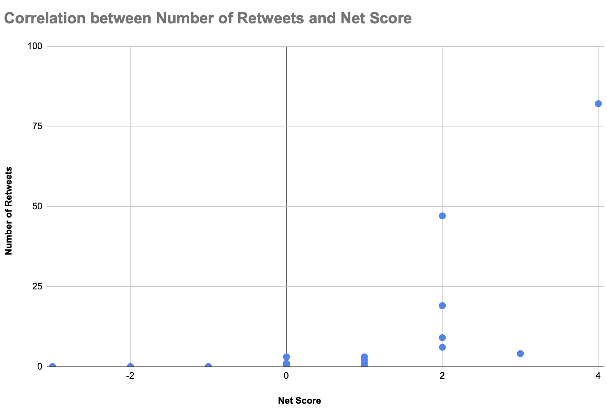

# Mini Twitter Sentiment Analysis

## 📊 Project Overview
This project is part of the Python specialization kurs. The goal was to build a simple **Sentiment Classifier** that analyzes synthetic Twitter data. The script processes tweet text to determine its emotional tone (positive, negative, or neutral) and compares this sentiment with user engagement metrics like retweets and replies.

## 🚀 Features
* **Text Processing:** Removes punctuation and normalizes text for analysis.
* **Sentiment Scoring:** Uses custom word lists to calculate:
    * **Positive Score:** Number of "happy" words.
    * **Negative Score:** Number of "angry" words.
    * **Net Score:** The overall sentiment (Positive - Negative).
* **Data Export:** Generates a `resulting_data.csv` file with all calculated scores and original engagement data.

## 📈 Results
The final step of the project was to visualize the relationship between the sentiment of a tweet and its popularity.

### Sentiment Score vs. Number of Retweets
Below is the scatter plot generated from the processed data:

> **Observation:** This chart helps to visualize whether positive or negative tweets tend to receive more retweets.

## 🛠️ Tech Stack
* **Language:** Python 3
* **Libraries:** `csv` (for data handling)
* **Tools:** VS Code, Git, Google Sheets (for visualization)

## 📂 File Structure
* `project_twitter_data.csv`: The raw input data.
* `app.py`: The main Python script.
* `resulting_data.csv`: The output file generated by the script.
* **`positive_words.txt`**: A reference list of words defined as "positive" for the scoring algorithm.
* **`negative_words.txt`**: A reference list of words defined as "negative" for the scoring algorithm.
* **`Diagram.png`**: The final scatter plot (Net Score vs. Retweets) exported from Google Sheets.
